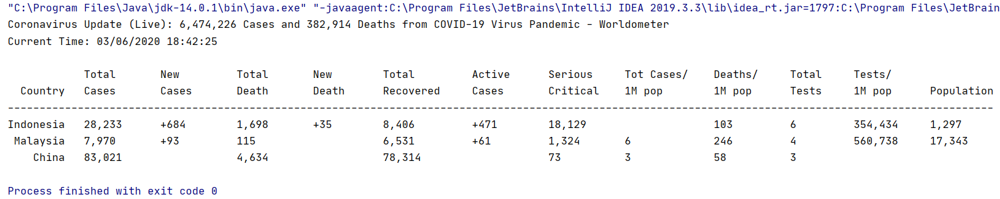

## Student Info:
261938 Lim Wen Liang    
     
     
2. Other related info (if any)

## Introduction

## Flow Diagram of the requirements

## User manual

## Result/Output

## UML Class Diagram

## Youtube Presentation

## References
1. https://jsoup.org/
2. https://www.tutorialspoint.com/java/index.htm