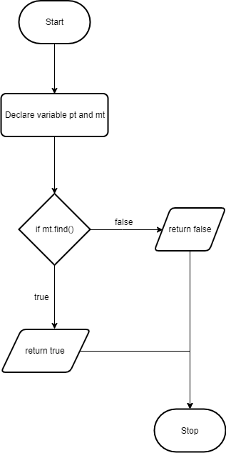
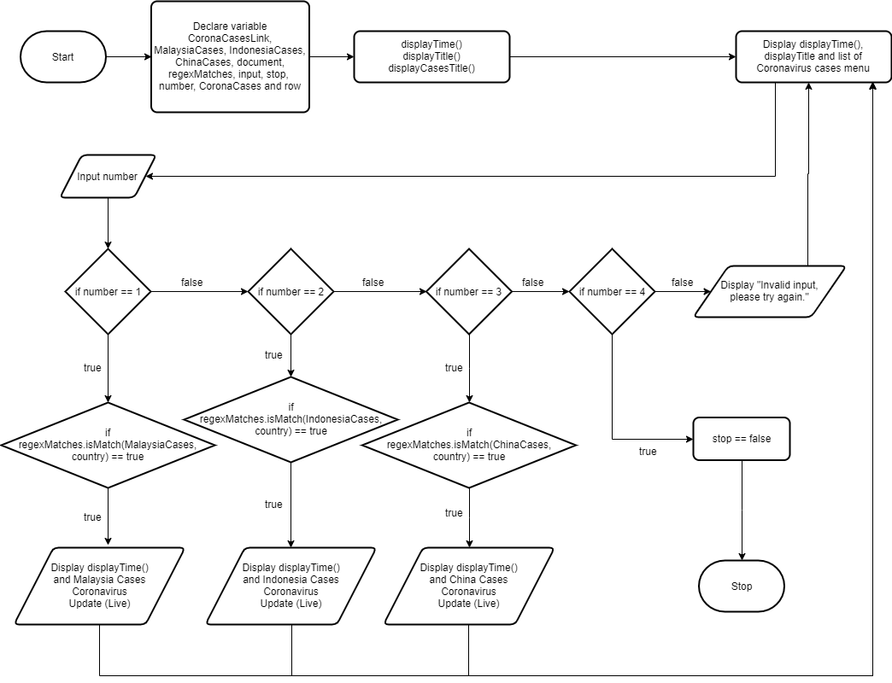
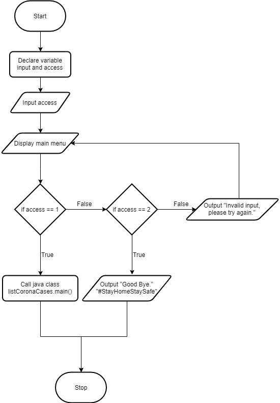
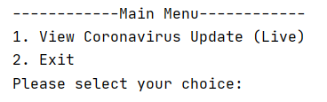
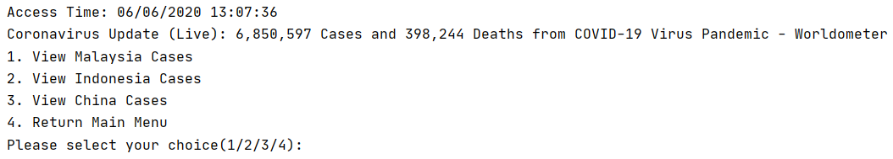
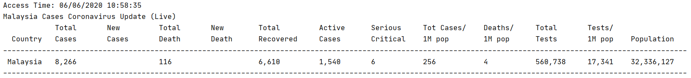
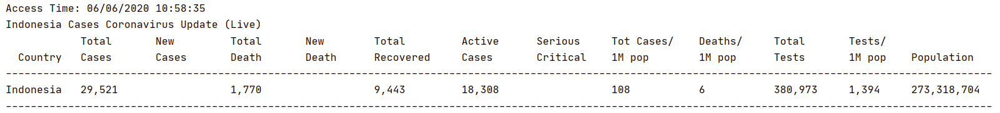
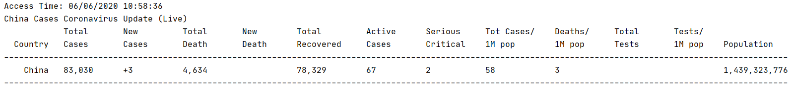
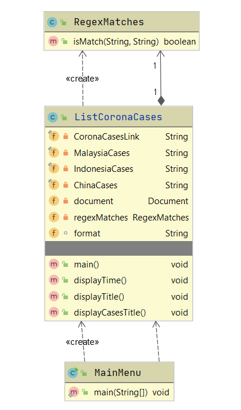

## Student Info:
261938 Lim Wen Liang   
     
     
2. Other related info (if any)

## Introduction
This program runs in IntelliJ Version 2020.1.2 (jdk 14) with Maven Version 1.11.3 and Java programming language.

## Flow Diagram of the requirements
#### RegexMatches 
  

#### ListCoronaCases 
  

#### MainMenu 
  

## User manual 
 
Insert number "1" to view Coronavirus cases live update lists. 
Insert number "2" to exit the system.  

 
Insert number "1-3" to view Coronavirus cases from 3 different countries. 
Insert number "4" to return back Main Menu.  

## Result/Output
Malaysia Cases

Indonesia Cases

China Cases

## UML Class Diagram

## Youtube Presentation
https://www.youtube.com/watch?v=XejxX_Bguj4&feature=youtu.be

## References
1. Jonathan Hedley. (n.d.). jsoup: Java HTML Parser. Retrieved June 8, 2020, from https://jsoup.org/
2. Tutorials Point. (n.d.). Java Tutorial. Retrieved Jun 8, 2020, from https://www.tutorialspoint.com/java/index.htm